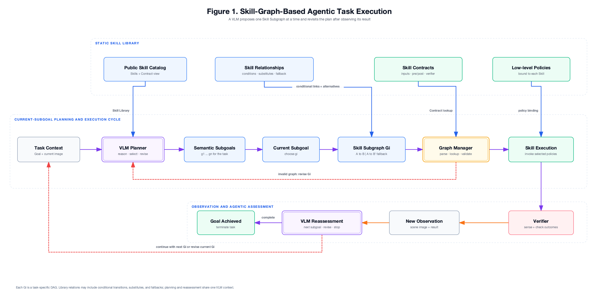
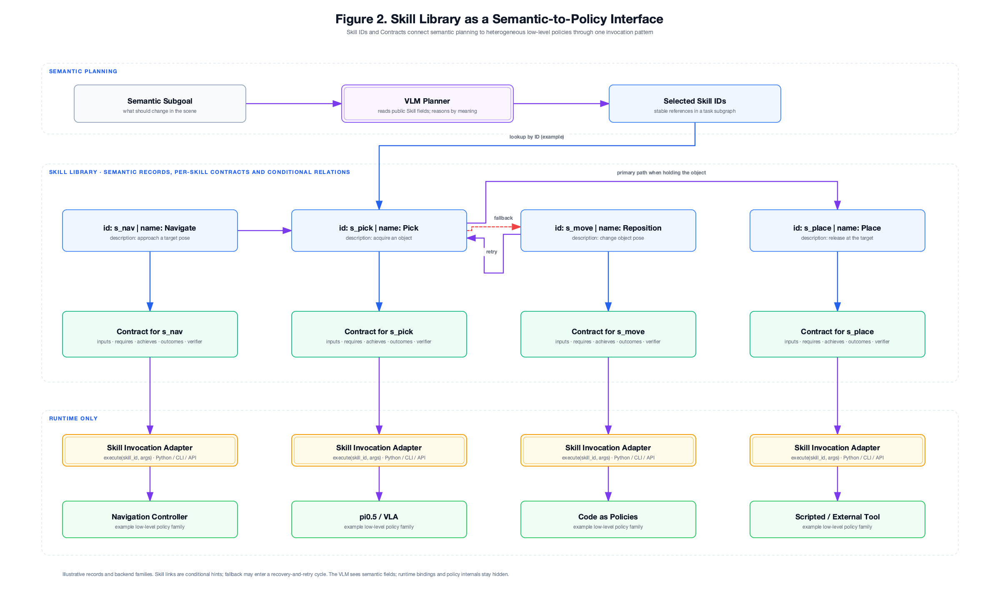

# Graph Manager

Graph Manager focuses on task-conditioned skill graphs and the VLM interface around them. It uses visual observations, a user's task, and a skill library to propose semantic subgoals and a skill subgraph for each subgoal. This repository defines how those outputs are represented, parsed, and checked against existing skill contracts. The robot skills and benchmark scenes are maintained by collaborators in the same project.

## Architecture

These figures show the intended architecture. The current planning loop, described below, produces all Subgoals and Skill Subgraphs in one model response; the illustrated per-Subgoal execution and reassessment loop is the longer-term design.

[](docs/diagrams/graph-manager-figure1.svg)

*Figure 1. A VLM plans semantic Subgoals, proposes a Skill Subgraph for the current Subgoal, and uses observations after execution to decide what to do next.*

[](docs/diagrams/graph-manager-figure2.svg)

*Figure 2. Skill IDs, descriptions, Contracts, conditional links, and fallback connect semantic planning to a uniform invocation interface. The policy families shown are illustrative backend examples, not current ZenoBench integrations.*

## Skill Library v1

The [Skill Library](skill_library/README.md) keeps one JSON Contract per task-level ZenoBench capability and generates one [complete public catalog](skill_library/skill_library.json). Its nine Skills are available for the model to select in a graph. The generated catalog includes conditional composition hints without implementation paths. The model will propose a new Skill DAG for each task. The current library is a documented interface and does not yet include a graph runner or independent visual verifiers.

Run `python3 skill_library/viewer/server.py` and open `http://127.0.0.1:8765` to browse the current library as a local, searchable Wiki-style page. Its overview draws all nine Skills and the 17 directed links represented by 10 documented connection groups. These are conditional composition hints, not an exhaustive transition graph or a runtime task DAG.

The [ZenoBench `skills.py` function inventory](docs/zenobench-skills-function-inventory.md) lists all 44 source callables and identifies the nine represented by task-level Skill Contracts. The other 35 are implementation details, not graph nodes.

## Planning loop

The planning loop accepts a goal, an optional current image or observation text, and the complete public Skill Library. One model response proposes all semantic Subgoals and one Skill Subgraph for each Subgoal. Graph Manager checks the proposal against public Skill IDs, Contract inputs, references, dependencies, and DAG structure. On failure, it sends path-addressed errors to the model in the same conversation and asks for a revised complete plan. The loop has a configurable attempt limit and does not execute robot Skills.

There are two optional model backends. `graph-manager-plan` uses the direct HTTP adapter and keeps the short conversation in Python. `graph-manager-plan-harness` uses the DeepSeek Harness Python SDK. Harness owns that backend's conversation history and local session persistence; Graph Manager sends only the initial task input and later validation feedback.

Create the isolated Python environment from the committed lock file with `uv`, then run the tests:

```bash
uv sync --extra dev
.venv/bin/python -m unittest discover -s tests
.venv/bin/ruff check .
.venv/bin/ruff format --check .
```

If `uv` is unavailable, `python3 -m venv .venv` followed by `.venv/bin/python -m pip install -e '.[dev]'` also works.

For a local VLM served through a vLLM OpenAI-compatible endpoint, run:

```bash
.venv/bin/graph-manager-plan \
  --goal-file goal.txt \
  --image scene.jpg \
  --base-url http://127.0.0.1:8000/v1 \
  --model YOUR_SERVED_VLM_NAME \
  --output run/plan.json
```

Add `--entity-catalog entities.json` to give the model a GT list of bindable IDs and types. Its format is:

```json
{"entities": [{"id": "apple", "types": ["MovableObject"]}]}
```

The catalog is optional. Without it, the model receives no ID list, and object references remain unresolved; the result status is `unresolved_references`. With it, `{"ref":"apple"}` must match an exact ID and a compatible Contract input type. GT catalog data should contain only IDs and types, not final evaluator truth. A later grounding adapter can resolve references from vision while keeping the graph JSON shape. An observation text file can be supplied with `--observation-file`, and `GRAPH_MANAGER_API_KEY` supplies an optional endpoint token. `--max-attempts` controls the repair limit. Run `graph-manager-plan --help` for all flags.

### DeepSeek Harness SDK backend

Install the optional SDK and its matching runtime wheel without changing the direct HTTP command:

```bash
uv sync --locked --extra dev --extra harness
mkdir -p run
cp examples/harness-local-vlm.patch.yml run/local-vlm.patch.yml
```

Edit `run/local-vlm.patch.yml` so `baseURL` points to the served endpoint and its model ID matches `--model`. The [example patch](examples/harness-local-vlm.patch.yml) registers an image-capable OpenAI-compatible route named `lab-vlm` in the full Harness `sdk` profile. Harness requires YAML for profile composition; the Skill Contracts and task graphs remain JSON. Supply the route's key through `LAB_VLM_API_KEY` (a dummy value is sufficient when the local endpoint does not authenticate).

```bash
export LAB_VLM_API_KEY=dummy
.venv/bin/graph-manager-plan-harness \
  --goal-file goal.txt \
  --image scene.png \
  --dsh-home run/dsh-home \
  --provider lab-vlm \
  --model YOUR_SERVED_VLM_NAME \
  --patch run/local-vlm.patch.yml \
  --output run/plan.json
```

This command uses one Harness session for the initial task and every corrective turn. The output records its `session_id`; Harness stores its history under the explicitly selected `--dsh-home`. Graph Manager automatically applies a [planner profile patch](graph_manager/harness_profile/cordis.patch.yml) to the full `sdk` profile: it keeps persistence and compaction but disables the bundled coding tools, workspace instructions, and DeepSeek telemetry and session-log contributors. Later `--patch` files can extend this profile deliberately. A turn has a 300-second deadline by default; change it with `--turn-timeout-seconds` for slower local inference. Use a fresh session ID for each command invocation: this SDK version persists sessions but cannot resume an existing ID in a new Python process. The selected model endpoint receives the planning inputs; local session storage does not imply that a remote model endpoint is local. The SDK is pinned as an optional pre-release dependency and remains separate from the GPU model server.

The model returns one JSON object:

```json
{
  "schema_version": 1,
  "kind": "task_plan",
  "subgoals": [{"id": "sg_1", "goal": "Hold the apple"}],
  "subgraphs": [{
    "subgoal_id": "sg_1",
    "nodes": [{
      "id": "n1", "skill_id": "skill_004",
      "args": {"object": {"ref": "apple"}}, "depends_on": []
    }]
  }]
}
```

Each Subgraph is a DAG for one Subgoal. `OptionalVector2` inputs must still appear and may be `null`. A rejected result includes `code`, `path`, and `message`; for example, an unknown Skill ID points to `$.subgraphs[0].nodes[0].skill_id`. Model outputs and validation issues are retained in `attempts`.

An optional `--state-file state.json` provides explicitly observed facts:

```json
{"facts": [{"predicate": "gripper_empty", "args": {}, "value": false}]}
```

Contracts list a small set of `checkable_requires`. Input-only conditions such as nonzero push displacement are checked anywhere in the plan. State facts are checked only for initially ready nodes of the first Subgoal. Missing facts are unknown rather than false. Other natural-language preconditions, physical execution, and the final task goal require future observation and Verifiers.
Facts bound to an object are checked only when an entity catalog grounds that object reference to an exact ID; zero-argument facts such as `gripper_empty` can be checked without the catalog.

### Code layout

Direct HTTP: `cli.py` → `PlanningLoop` → model response → domain validation → accepted plan or feedback in the same `Conversation`.

Harness SDK: `harness_cli.py` → `HarnessPlanningService` → persistent Harness session → domain validation → new feedback turn in that session.

| Directory | Responsibility |
| --- | --- |
| `application/` | Plan validation feedback and retry policy; only the direct HTTP path owns a Python conversation |
| `domain/` | Planning data and pure JSON, Contract, and graph checks |
| `prompts/` | Initial model instruction and corrective feedback |
| `adapters/` | OpenAI-compatible HTTP model, DeepSeek Harness SDK session, and JSON Skill Library loader |
| `ports.py` | Small interfaces between the loop and its adapters |
| `cli.py`, `harness_cli.py`, `plan_inputs.py` | Command-line input, dependency construction, and result output |

Neither the domain nor the prompt builder performs HTTP or file I/O.

## Goal wording baseline

The five tasks below provide paired goal descriptions for a future comparison. **Original instruction** preserves the English task instruction from ZenoBench verbatim. **Detailed goal** makes the existing success conditions and permitted alternatives explicit. It describes the desired result without prescribing a skill, execution sequence, or object location in a particular scene variant.

Both wordings are intended to be evaluated against the same ZenoBench success conditions. A later comparison should keep the scene variants, available skills, execution system, and evaluator fixed so that goal wording is the variable under study. The detailed wording does not reveal which optional objects are present in a particular scene.

### Collect fruits

**Original instruction**

> Collect the fruits and place them in a container on the low bookcase in the living room.

**Detailed goal**

> Place both the apple and the orange inside the same available container, either a fruit basket or a serving tray. Leave that container upright on the low bookcase in the living room. Leave all doors and drawers closed. Do not leave any task object that began more than 10 cm above the floor lying on the floor, unless it is inside a container.

### Tidy toys

**Original instruction**

> Collect the toys and store them in the toy box.

**Detailed goal**

> Place the toy car, toy block, and rubber duck inside the same available container, either the toy box or a storage basket. Leave the chosen container upright. Leave all doors and drawers closed. Do not leave any task object that began more than 10 cm above the floor lying on the floor, unless it is inside a container.

### Shelve books

**Original instruction**

> Collect the books and place them on the bookshelf.

**Detailed goal**

> Place both books on a bookcase. Each book may be on either available bookcase, on its top or on a shelf level. Leave all doors and drawers closed. Do not leave any task object that began more than 10 cm above the floor lying on the floor, unless it is inside a container.

### Set up breakfast

**Original instruction**

> Set up the dining table for breakfast.

**Detailed goal**

> Arrange a breakfast place setting on the dining table with one plate or bowl, one cup or mug, and a spoon. Keep the selected plate or bowl and the selected cup or mug upright. All three selected items must be on the dining table and within 0.5 m of one another. Leave all doors and drawers closed. Do not leave any task object that began more than 10 cm above the floor lying on the floor, unless it is inside a container.

### Prepare the study desk

**Original instruction**

> Prepare the study desk with a notebook, a pen, and a mug.

**Detailed goal**

> Place a notebook, either a pen or a pencil, and either a mug or a cup on the study desk. Keep the selected mug or cup upright. Leave all doors and drawers closed. Do not leave any task object that began more than 10 cm above the floor lying on the floor, unless it is inside a container.
